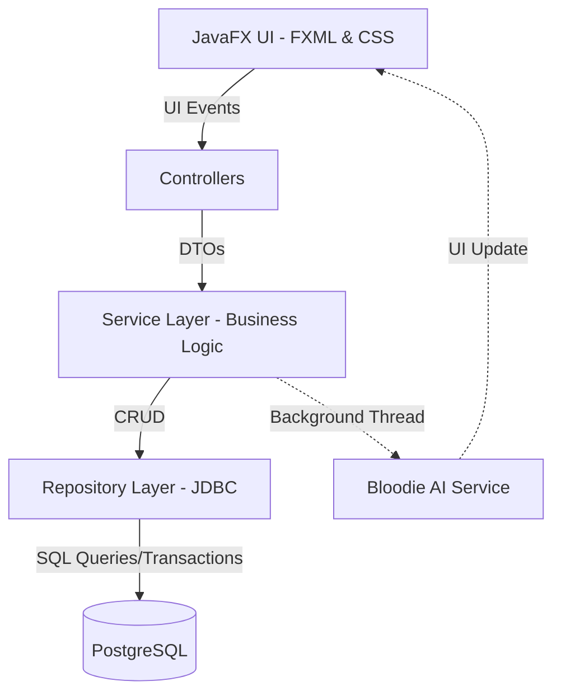

  <h1>🩸 BloodLife</h1>
  <h3>Advanced Blood Donation Management System 🚧</h3>
  
<i>A multi-role desktop platform, built with JavaFX, designed to optimize medical workflows and save lives.</i>

  <!-- Badges -->
  

    
    
    
    
    
  

## 📖 Table of Contents
- [🎯 Project Scope](#-project-scope)
- [🏗️ Architecture & Technologies](#️-architecture--technologies)
- [✨ Core Features by Role](#-core-features-by-role)
  - [A. Donor Module](#a-donor-module)
  - [B. Medical Staff Module](#b-medical-staff-module)
  - [C. Blood Bank & Stock Management](#c-blood-bank--stock-management)
  - [D. Administrator Module](#d-administrator-module)
- [🤖 "Bloodie" AI Assistant](#-bloodie-ai-assistant)
- [🗄️ Database Structure](#️-database-structure)
- [⚙️ Installation & Setup](#️-installation--setup)

---

## 🎯 Project Scope
**BloodLife** is a modern desktop application designed to digitize and streamline the entire blood donation process. By bridging the gap between Donors, Medical Professionals, and Administrators, the system provides a fluid, secure interface that guarantees the traceability of every blood unit and ensures rapid response times during medical emergencies.

---

## 🏗️ Architecture & Technologies

The application strictly adheres to a **Layered Architecture** and the **MVC (Model-View-Controller)** design pattern, ensuring perfect decoupling between the business logic and the graphical interface.

* **Frontend (UI):** `JavaFX` (layouts built via `.fxml` and fully styled using a comprehensive `style.css` file featuring custom animations, shadows, and responsive design).
* **Backend (Logic):** Standard `Java`.
* **Persistence (Database):** `PostgreSQL` via `JDBC`. Implements secure SQL VIEWs and custom ENUM types.
* **Security:** All user passwords are encrypted using the **BCrypt** hashing algorithm before database insertion.

---

## ✨ Core Features by Role

### A. Donor Module
Delivers an interactive experience designed to inform, guide, and protect the user.

* **Dynamic UI Placeholder:** The dashboard dynamically adapts to the user's state. If no appointment exists, it displays a visual prompt (📭) to encourage booking. If booked, it renders a detailed Calendar Card allowing direct updates (UPDATE in DB) or cancellations (DELETE in DB).
* **Medical Pre-Screening:** A mandatory, dynamically generated 8-question form fetched from the database ensures temporarily ineligible users cannot book slots.
* **The "Golden Rule" (90-Day Lock):** The system calculates the exact millisecond difference since the last `COMPLETED` donation. If the interval is too short, the user is locked out of scheduling and receives a precise alert detailing how many days remain until they can donate again.
* **Emergency Alerts Banner:** A prominent red banner appears globally on the dashboard when hospitals broadcast urgent needs matching the user's specific blood type and Rh factor.
* **Comprehensive History:** A dedicated interface displaying all past medical visits and test results, generated via SQL `LEFT JOIN` queries.

### B. Medical Staff Module (Queue & Collection)
Engineered to ensure absolute medical safety and inventory traceability.

* **Live Waiting List:** A real-time synchronized `ListView` component fetching today's donors who hold the `SCHEDULED` status.
* **Strict Medical Validation:** During collection, the system validates vital signs. If entered parameters exceed safety thresholds (e.g., Systolic > 180 or Diastolic > 110), the application halts the process and rejects the donor for their own safety.
* **UUID Traceability:** Upon successful collection, the system automatically assigns a cryptographically unique identifier (e.g., `BL-5f9a3b...`) via `UUID.randomUUID()` to the blood bag.
* **Atomic SQL Transactions:** Finalizing a donation triggers a highly secure, multi-step database transaction (`con.setAutoCommit(false)`). The system simultaneously executes 4 operations: updates appointment status, performs a join to fetch blood type, inserts the new unit into the permanent stock, and updates the donor's medical record. Any failure triggers an automatic `rollback()`, preventing data corruption.

### C. Blood Bank & Stock Management
Complete operational control over life-saving resources.

* **Secure Data Views:** The main `TableView` populates its data directly from a protected PostgreSQL VIEW (`stoc_detaliat`).
* **Multi-Criteria Filtering:** Medical staff can instantly filter the database by Blood Type (O, A, B, AB) or collection type via dynamic ComboBoxes.
* **Bag Lifecycle Workflow:** 1-click status updates allowing staff to mark units as `USED`, `RESERVED`, or `EXPIRED`.
* **Emergency Alert Broadcasting:** In critical shortage scenarios, staff can select a specific blood type and broadcast a custom SOS message. The system calculates the number of eligible donors in the region and pushes the notification directly to their dashboards.

### D. Administrator Module
The overarching control center for managing the platform's infrastructure and personnel.

* **Global User Management:** Full CRUD (Create, Read, Update, Delete) capabilities over system users. Admins can register new medical staff, elevate privileges, or suspend accounts.
* **Donation Center Configuration:** Admins can dynamically add new physical donation centers, update their addresses, and adjust maximum daily capacities.
* **System Analytics & Reporting:** Generation of visual charts and metrics (monthly donor trends, overall center activity, and aggregate stock distribution) to aid high-level decision-making.
* **Audit & Security:** Oversight of platform logs and capability to manually reset locked user credentials securely.

---

## 🤖 "Bloodie" AI Assistant

To reduce first-time donor anxiety and provide 24/7 support, the application integrates **Bloodie**, an embedded smart chatbot.
* **Thread Optimization:** Runs entirely on a **separate background thread**, ensuring the primary JavaFX UI thread remains perfectly fluid and unblocked.
* **UX Enhancements:** Features automatic scrolling to the latest message and smooth slide-in/slide-out animations anchored to the bottom-right of the screen.

---

## 🗄️ Database Structure

The application is backed by a highly normalized relational structure, strictly enforcing `FOREIGN KEY` and `ON DELETE CASCADE` constraints to maintain referential integrity.

* **1:1 Relationships:** The `users` table (holding ID, Email, and a Role `ENUM`) is directly extended by the `donors` table (`user_id REFERENCES users(id)`).
* **Complex Joins:** The `appointments` table serves as the crucial junction bridging `donors` and `donation_centers`.
* **Inventory Master:** The `blood_bags` table records the ultimate biological data (UUID code, collection type, blood group, Rh, volume in ml) and the real-time status of the physical unit.

---

  
<i>Developed with a passion for medical innovation and saving lives. ❤️</i>

